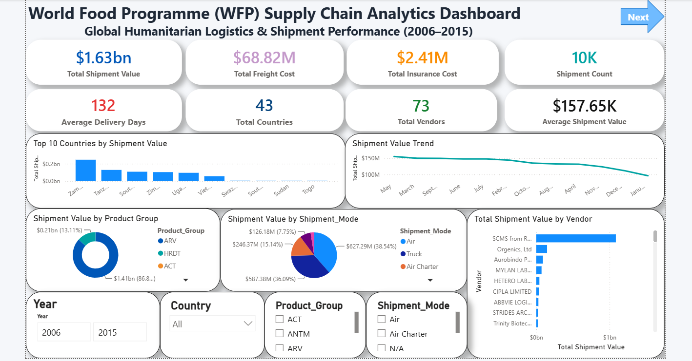
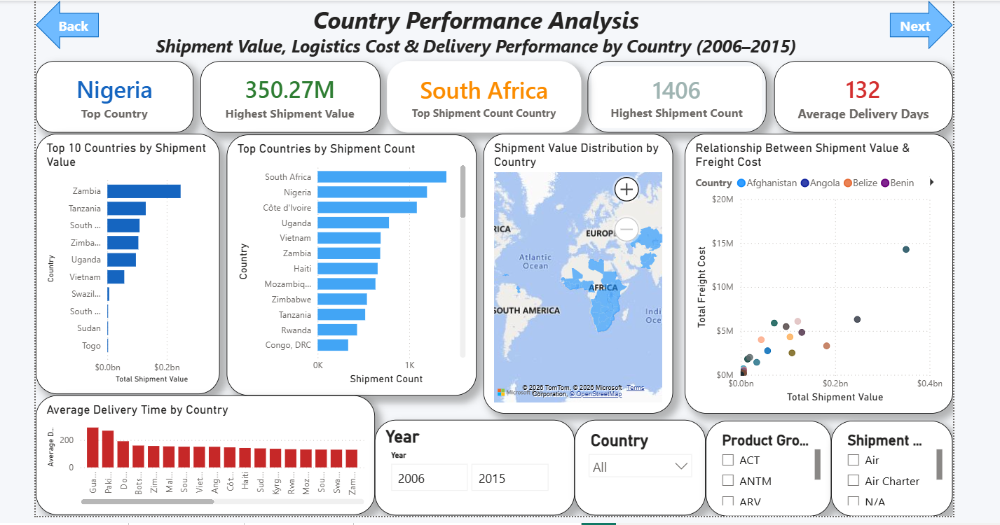
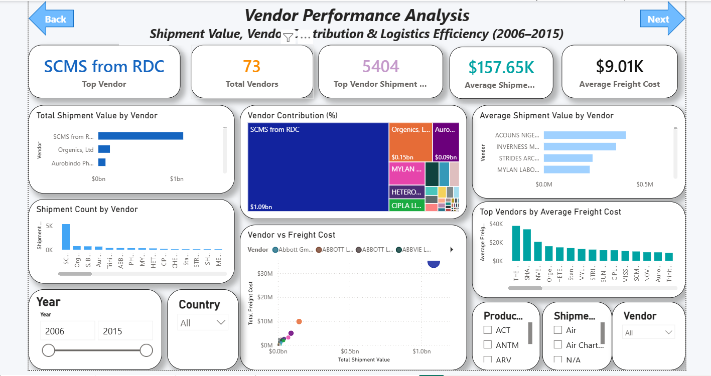
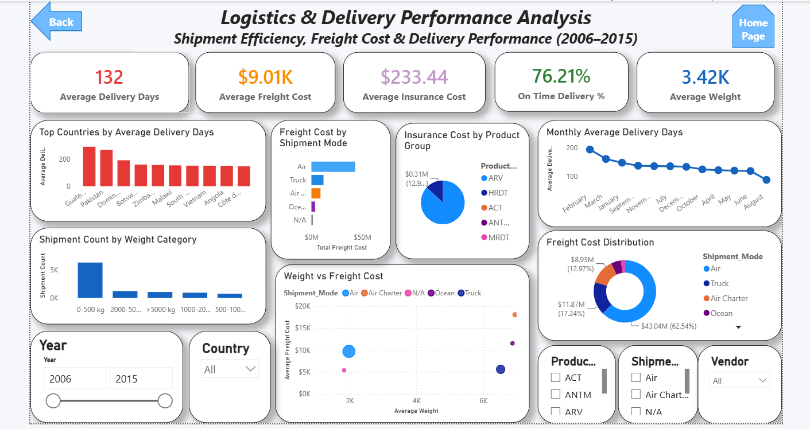

# 🌍 World Food Programme (WFP) Supply Chain Analytics Dashboard



## 📌 Project Overview

This project presents an end-to-end **Supply Chain Analytics** solution developed using **Excel, SQL, and Power BI**. It analyzes the **World Food Programme (WFP)** humanitarian shipment data from **2006–2015** to uncover trends in shipment value, logistics costs, vendor performance, country performance, and delivery efficiency.

The dashboard enables decision-makers to monitor global humanitarian logistics operations through interactive visualizations and business KPIs.

---

## 🎯 Business Problem

The World Food Programme (WFP) manages global humanitarian shipments across multiple countries and vendors. Efficient monitoring of shipment operations is essential to reduce logistics costs, improve delivery performance, and optimize vendor efficiency.

This project answers key business questions such as:

- Which countries receive the highest shipment value?
- Which vendors contribute the most to total shipments?
- Which shipment mode is used most frequently?
- What is the average delivery time?
- Which countries experience longer delivery delays?
- How are freight and insurance costs distributed?
- Does shipment weight influence logistics costs?

---

## 📂 Dataset Information

| Item | Details |
|------|---------|
| Dataset | World Food Programme (WFP) Supply Chain Shipment Data |
| Organization | World Food Programme (United Nations) |
| Time Period | 2006 – 2015 |
| Total Records | 10,324 |
| Countries | 43 |
| Vendors | 73 |
| Industry | Humanitarian Supply Chain & Logistics |

---

## 🛠 Tools & Technologies

- Microsoft Excel
- SQL
- Microsoft Power BI
- DAX (Data Analysis Expressions)
- Git & GitHub

---

# 📊 Dashboard Pages

## 1️⃣ Executive Dashboard

Provides a high-level overview of global shipment performance.

### KPIs

- Total Shipment Value
- Total Freight Cost
- Total Insurance Cost
- Shipment Count
- Average Shipment Value
- Average Delivery Days
- Total Countries
- Total Vendors

### Visuals

- Shipment Value Trend
- Top Countries by Shipment Value
- Product Group Distribution
- Shipment Mode Distribution
- Vendor Shipment Value

---

## 2️⃣ Country Performance Analysis

Analyzes shipment performance across countries.

### KPIs

- Top Country
- Highest Shipment Value
- Top Shipment Count Country
- Highest Shipment Count
- Average Delivery Days

### Visuals

- Top Countries by Shipment Value
- Shipment Count by Country
- Filled Map
- Shipment Value vs Freight Cost
- Average Delivery Days by Country

---

## 3️⃣ Vendor Performance Analysis

Evaluates vendor contribution and logistics performance.

### KPIs

- Top Vendor
- Total Vendors
- Highest Shipment Count
- Average Shipment Value
- Average Freight Cost

### Visuals

- Shipment Value by Vendor
- Vendor Contribution (%)
- Shipment Count by Vendor
- Average Shipment Value by Vendor
- Vendor vs Freight Cost
- Top Vendors by Average Freight Cost

---

## 4️⃣ Logistics & Delivery Performance Analysis

Focuses on logistics efficiency and delivery metrics.

### KPIs

- Average Delivery Days
- Average Freight Cost
- Average Insurance Cost
- On-Time Delivery %
- Average Weight

### Visuals

- Top Countries by Average Delivery Days
- Freight Cost by Shipment Mode
- Insurance Cost by Product Group
- Monthly Average Delivery Days
- Shipment Count by Weight Category
- Weight vs Freight Cost
- Freight Cost Distribution

---

# 📈 Key Performance Indicators (KPIs)

- Total Shipment Value
- Shipment Count
- Total Freight Cost
- Total Insurance Cost
- Average Shipment Value
- Average Delivery Days
- Average Freight Cost
- Average Insurance Cost
- Average Weight
- On-Time Delivery %
- Total Countries
- Total Vendors

---

# 💡 Key Business Insights

- Identified the highest-performing countries based on shipment value.
- Analyzed vendor contribution to global humanitarian shipments.
- Compared shipment modes by freight cost and shipment volume.
- Evaluated delivery performance across countries.
- Measured freight and insurance cost distribution.
- Examined the relationship between shipment weight and freight cost.
- Built an interactive dashboard to support logistics decision-making.


---

# 📷 Dashboard Preview

## 🏠 Executive Dashboard


---

## 🌍 Country Performance Analysis



---

## 🏢 Vendor Performance Analysis



---

## 🚚 Logistics & Delivery Performance Analysis



---

# 📁 Repository Structure

```
WFP-Supply-Chain-Analytics
│
├── Dashboard
│   └── WFP Supply Chain Analytics.pbix
│
├── Dataset
│   └── WFP_Supply_Chain.xlsx
│
├── SQL
│   └── WFP_Supply_Chain_SQL.sql
│
├── Images
│   ├── Dashboard_Page1.png
│   ├── Dashboard_Page2.png
│   ├── Dashboard_Page3.png
│   └── Dashboard_Page4.png
│
├── Documentation
│   └── WFP Supply Chain Analytics Case Study.pdf
│
├── Presentation
│   └── WFP Supply Chain Analytics Presentation.pptx
│
└── README.md
```

---

# 🚀 Future Improvements

- Real-time dashboard integration
- Predictive delivery analytics using Machine Learning
- Vendor performance forecasting
- Logistics cost optimization
- Interactive drill-through reporting
- Automated data refresh using Power BI Service

---

# 📚 Skills Demonstrated

- Data Cleaning
- Data Transformation
- SQL Querying
- DAX Calculations
- Data Modeling
- Power BI Dashboard Development
- Data Visualization
- Business Intelligence
- Supply Chain Analytics
- Logistics Performance Analysis

---

# 👤 Author

**Rohit Gurjar**

Aspiring Data Analyst

### Skills

- SQL
- Power BI
- Excel
- Python
- Data Analysis
- Data Visualization
- Dashboard Development

### Connect with Me

**LinkedIn:**  
https://www.linkedin.com/in/rohit-gurjar-data

**GitHub:**  
https://github.com/rohitgurjar-data/WFP-Supply-Chain-Analytics
---

## ⭐ If you found this project helpful, please consider giving it a Star.
